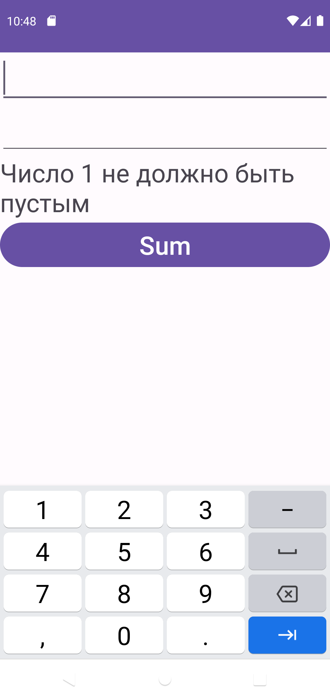
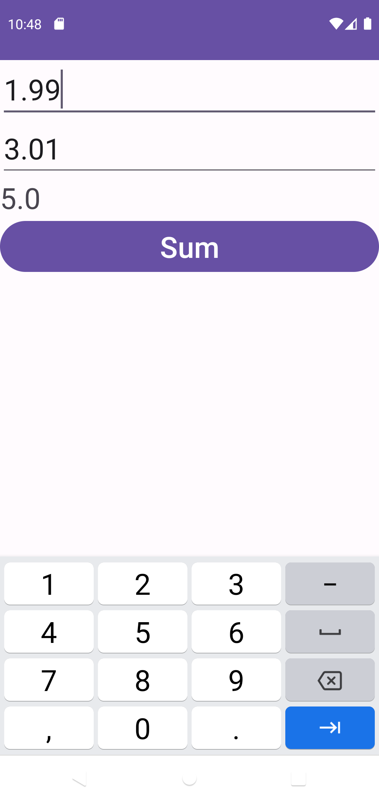

# AddTwoNums
Домашнее задание: Доработать приложение, чтобы
1) реализовать проверку на пустые значения в полях numA, numB
2) исправить разметку, чтобы можно было вводить только числа
3) сделать поддержку вещественных (не целых чисел)
## Демонстрация

  
  
  
  

