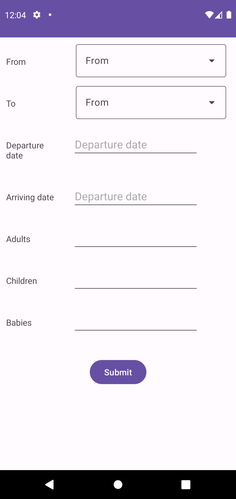
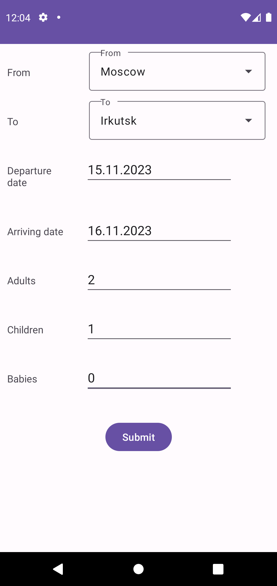
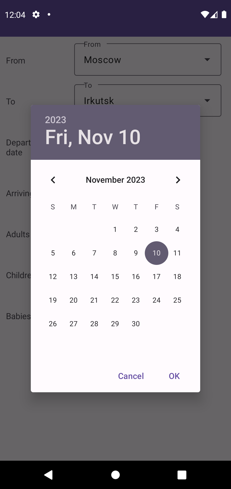
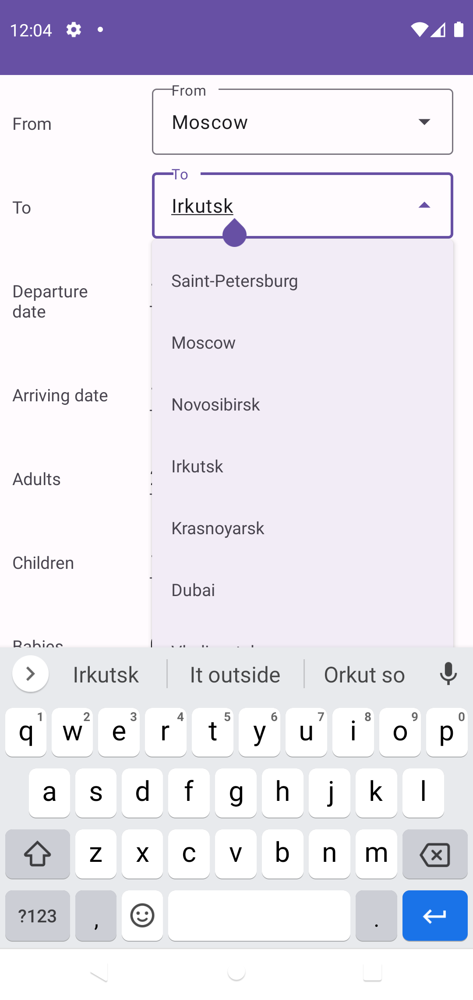

# Aviabuys

Разработайте интерфейс мобильного приложения для поиска авиабилетов.

Он должен содержать следующие элементы:

- Выпадающие списки для выбора городов вылета и прилёта
- Текстовые поля для ввода дат вылета и прилёта (одинаковой ширины)
- Текстовые поля для числа пассажиров (взрослых, детей, младенцев)  (поля одинаковой ширины)
- Кнопку поиска
  За реализацию выбора даты с помощью подходящего виджета - дополнительный балл.

Список городов должен хранится в виде массива строк (strings.xml)

Сделайте любой из вариантов вёрстки: вложенные LinearLayout разной ориентации и RelativeLayout

В качестве ответа приложите необходимые XML-файлы и отображение на устройства/среде разработки

# Демонстрация

  
  
  
  

