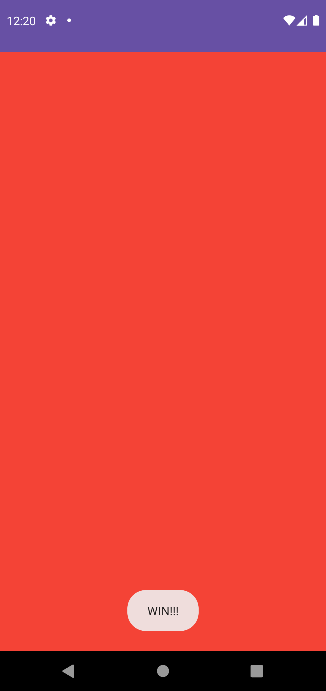

# Color tiles game

Для практического знакомства с обработкой событий и разметкой разработаем несложную игру Color
Tiles (цветные плитки). На экране Вы видите поле 4x4 клетки. Каждая клетка может быть светлого или
тёмного цвета. При нажатии на клетку, все клетки, находящиеся на той же горизонтали и вертикали
меняют цвет на противоположный. В начале игры плитки имеют случайный цвет (тёмный или светлый). Цель
игры - привести плитки к одному цвету.

## Демонстрация

  
  

