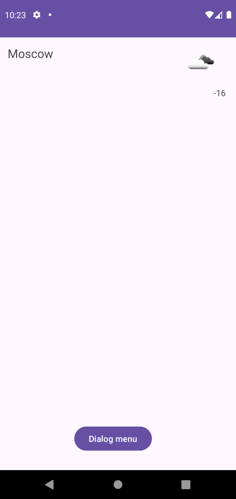
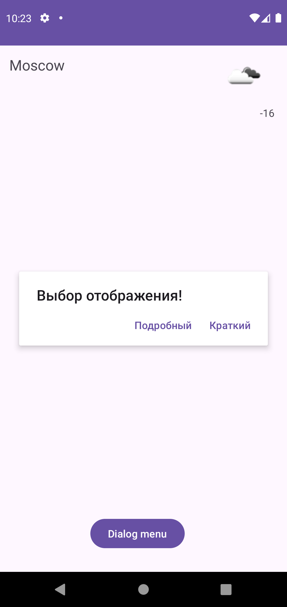
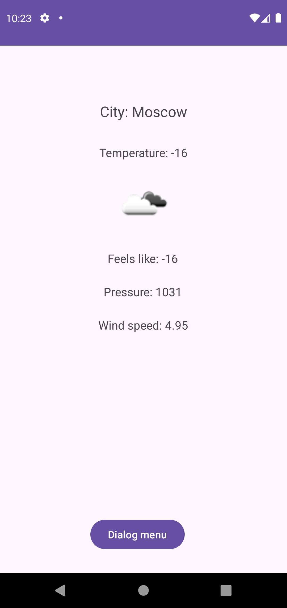

# Переключение фрагментов в AlertDialog

Продолжая разработку приложения "Погода" реализуйте переключение фрагментов (с которыми работали в прошлом задании) с различными вариантами дизайна с помощью диалогового окна.

# Демонстрация

  
  
  

