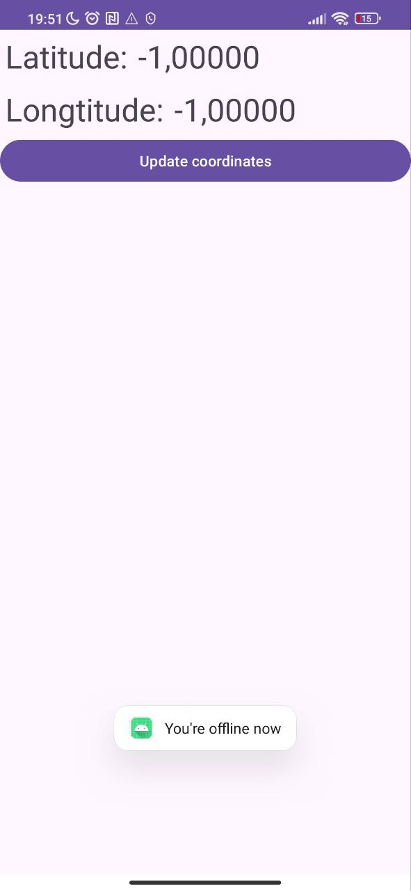

# Использование геолокации

За основу используйте проект-заготовку   https://github.com/ipetrushin/GPSLocation24

Необходимо реализовать 

    обработку возврата в активность после запроса на разрешение у пользователя на геолокацию
    отслеживать отключение геолокации (отображать в приложении, что вы offline)
    отображать, какие провайдеры геолокации доступны (см.  https://developer.android.com/reference/android/location/LocationManager)

# Демонстрация

  
  
  

