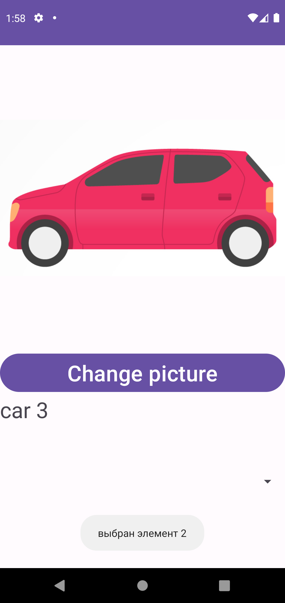
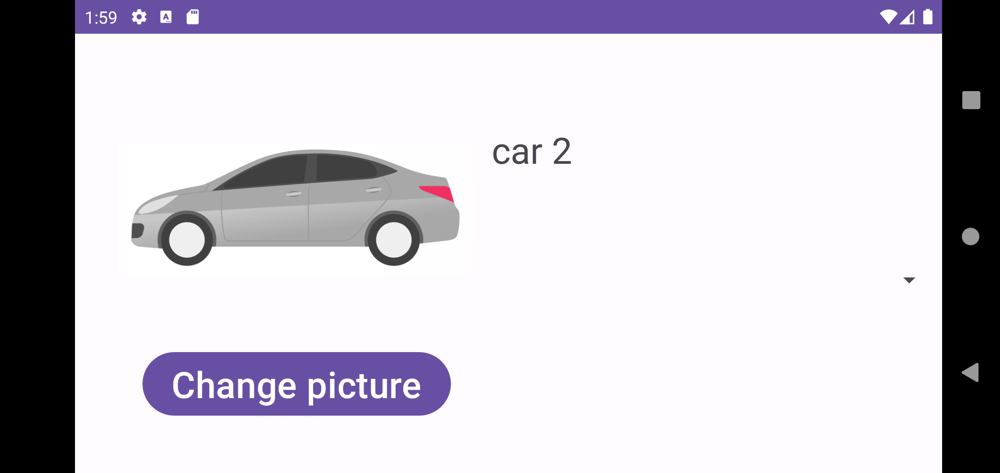

# Адаптация разметки для альбомной/портретной ориентации

Используя проект-заготовку   https://github.com/ipetrushin/PortraitLandscapePresentK2023

Нужно, что бы при перевороте экрана использовалась соответствующая разметка

При нажатии на кнопку картинка меняется на следующую (car1, car2, car3)
# Демонстрация

  
  

