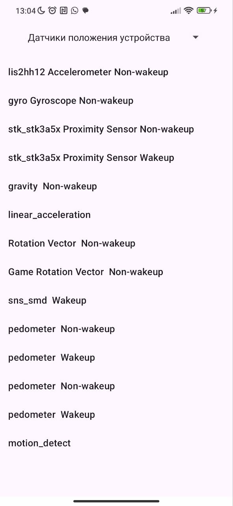
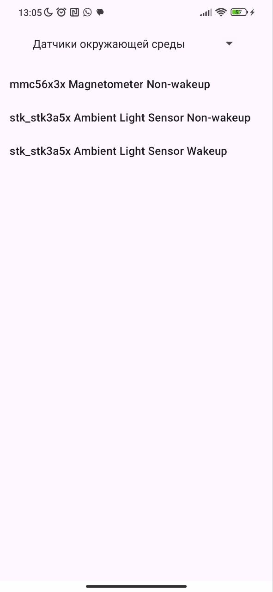

# Отображение списка сенсоров

Реализуйте приложение, отображающее список сенсоров, доступных на устройстве. Сгруппируйте сенсоры в три категории:

Датчики окружающей среды

Датчики положения устройства

Датчики состояния человека

Категория выбирается в выпадающем списке (Spinner), список датчиков - в ListView/RecyclerView

# Демонстрация

  
  
  

