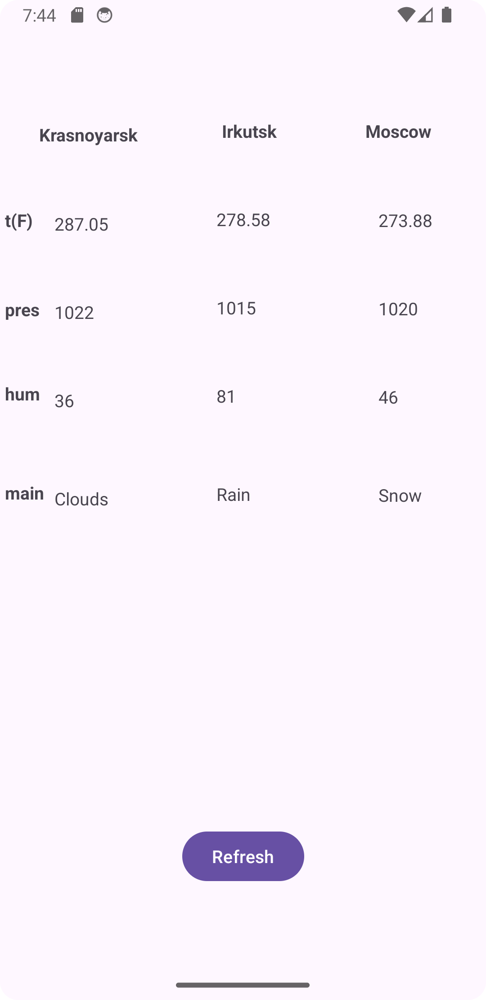

# Использование WorkManager для получения прогноза погоды

Используем хорошо известный пример с прогнозом погоды (или любой другой на ваш выбор)  https://github.com/ipetrushin/CurrentWeatherDataBinding

Реализуйте

​получение прогноза через API OpenWeatherMap
серию запросов по очереди (например, для нескольких городов) (см.  https://developer.android.com/topic/libraries/architecture/workmanager/advanced#chained)
Заготовка с использованием WorkManager  https://github.com/ipetrushin/WorkManagerDemo

# Демонстрация

  

